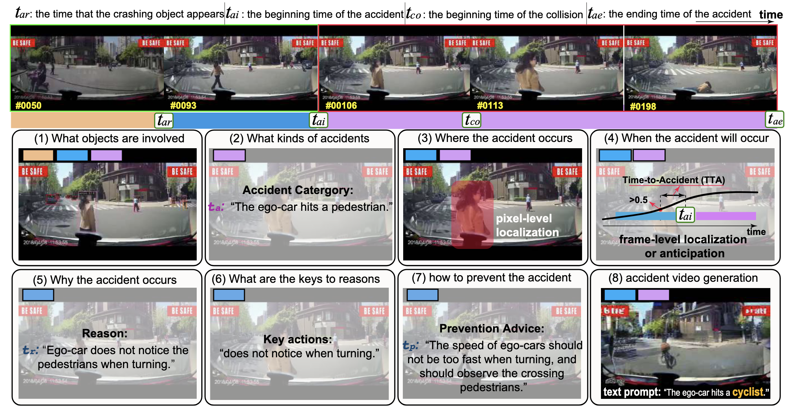

# LOTVS-MMAU(Multi-Modal Accident video Understanding)

This is the official Repo for paper "Abductive Ego-View Accident Video Understanding for Safe Driving Perception"[CVPR2024 Highlight]

[Paper MM-AU](https://arxiv.org/abs/2403.00436)
[Project Homepage](http://www.lotvsmmau.net/)

## MM-AU Datasets

<div align="center">
  
  <div>&nbsp;</div>

  <div>&nbsp;</div>
</div>

### Introduction

We present MM-AU, a novel dataset for Multi-Modal Accident video Understanding. MM-AU contains 11,727 in-the-wild ego-view accident videos, each with temporally aligned text descriptions. We annotate over 2.23 million object boxes and 58,650 pairs of video-based accident reasons, covering 58 accident categories.
MM-AU consists of two datasets, [LOTVS-Cap](https://github.com/JWFangit/LOTVS-CAP) and [LOTVS-DADA](https://github.com/JWFangit/LOTVS-DADA).

MM-AU is the first large-scale dataset for multi-modal accident video understanding for safe driving perception. It has the following highlights:

- first multi-modal accident video understanding benchmark in the safe driving field.
- MM-AU owns 11,727 in-the-wild ego-view accident videos.
- Each video is temporally aligned with the text descriptions of accident reasons, prevention solutions, and accident categories.
- 58.6K pairs of video-based accident reason answers (ArA) are annotated.
- Over 2.23 million object boxes are manually annotated for over 463K video frames.
- There are 58 accident categories are annotated, and the accident categories are determined by the participant-relations defined in DADA-2000.
- MM-AU facilitates 8 tasks of traffic accident video understanding (e.g. ① what objects are involved, ② what kinds of accidents, ③ where and ④ when the accident will occur, ⑤ why the accident occurs, ⑥ what are the keys to accident reasons, ⑦ how to prevent it, and ⑧ multimodal accident video diffusion). In addition, each task may be promoted by the developing of other related tasks.
- ONLY free for academic use.
If you are interested for MM-AU,please contact lotvsmmau@gmail.com

### Video_Metadata annotations

An example:

```
{
"video_hashcode": {
        "video_name": "1_1",
        "id": "1",
        "type": "1",
        "weather": "1",
        "light": "1",
        "scenes": "4",
        "linear": "1",
        "accident occurred": "1",
        "abnormal_start_frame": "30",
        "abnormal_end_frame": "115",
        "accident_frame": "63",
        "total_frames": "440",
        "t_ai": "30",
        "t_co": "63",
        "t_ae": "115",
        "texts": "a pedestrian crosses the road",
        "causes": "Pedestrian does not notice the coming vehicles when crossing the street",
        "measures": "When passing the zebra crossing, drivers must slow down. When pedestrians or non-motor vehicles cross the zebra crossing, they should stop and give way to other normal running vehicles; When crossing the road, pedestrians must follow the zebra crossing, carefully observe the traffic, and do not cross the road in a hurry."
    }
}
```

Explanation:

- `video_hashcode`: Unique identifiers generated for all 11730 videos
- `video_name`: Consists of the type to which the video accident belongs and the serial number
- `type`: The type of the accident (you can find all the accident types in file)
- `weather`: sunny,rainy,snowy,foggy (1-4)
- `light`: day,night (1-2)
- `scenes`: highway,tunnel,mountain,urban,rural (1-5)
- `linear`: arterials,curve,intersection,T-junction,ramp (1-5)
- `accident occurred`: whether an accident occurred (1/0)
- `t_ai`: Accident window start frame
- `t_co`: Collision start frame
- `t_ae`: Accident window end frame
- `texts`: Description of the accident
- `causes`: Causes of the accident
- `measures`: Advice on how to avoid accident

## Task & Benchmark

MM-AU supports a variety of tasks due to its multimodal characteristics, and the following describes the application of MM-AU to various tasks.

### Object Detection

In Object Detection Benchmark,we use the Cocodataset format to organize our data, the data we used in the paper's detection benchmark in the link.
All the results were conducted by [MMDetection](https://github.com/open-mmlab/mmdetection) toolbox, checkpoints and config file will be released sonn.

Cocodataset format labels and images can be downloaded from here

All the download link of **baidunetdisk** will be released soon.

All the download link of **google drive** will take a lot longer.


## Citation

If our work and repo is helpful to you, please give us a **free star** and **cite our paper**!

```
@article{fang2024abductive,
  title={Abductive Ego-View Accident Video Understanding for Safe Driving Perception},
  author={Fang, Jianwu and Li, Lei-lei and Zhou, Junfei and Xiao, Junbin and Yu, Hongkai and Lv, Chen and Xue, Jianru and Chua, Tat-Seng},
  journal={arXiv preprint arXiv:2403.00436},
  year={2024}
}
```

