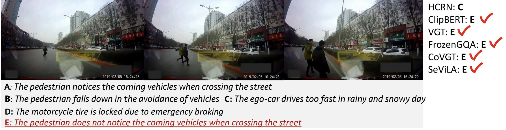

# Ego-view Accident Reason Answering Evaluation

  
  
&nbsp;

  
&nbsp;

Ego-view accident reason answering is a multi-choice Video Question Answering (VQA) task. However, we target the question “What is the reason for the accident in this video?”. The performance is measured by the accuracy (Acc), i.e., the percentage of questions that are correctly answered.

## Benchmark

| ID | Method | Year | Code | Acc | Params | Runtime | Environment |
|:--:|:--:|:--:|:--:|:--:|:--:|:--:|:--:|
| 1 | [HCRN](https://arxiv.org/abs/2002.10698) | 2020 | [code](https://github.com/thaolmk54/hcrn-videoqa) | 64.65% | 43 M | ... | GeForce RTX 3090 |
| 2 | [ClipBERT](https://openaccess.thecvf.com/content/CVPR2021/html/Lei_Less_Is_More_ClipBERT_for_Video-and-Language_Learning_via_Sparse_Sampling_CVPR_2021_paper.html) | 2021 | [code](https://github.com/jayleicn/ClipBERT) | 72.71% | 137 M | ... | GeForce RTX 3090 |
| 3 | [VGT](https://link.springer.com/chapter/10.1007/978-3-031-20059-5_3) | 2022 | [code](https://github.com/sail-sg/vgt) | 68.66% | 143 M | ... | GeForce RTX 3090 |
| 4 | FrozenGQA | 2023 | code | 77.01% | 30 M | ... | GeForce RTX 3090 |
| 5 | [COVGT](https://ieeexplore.ieee.org/document/10172254) | 2023 | [code](https://github.com/doc-doc/covgt) | 79.97% | 159 M | ... | GeForce RTX 3090 |
| 6 | [SeViLA](https://arxiv.org/abs/2305.06988) | 2023 | [code](https://github.com/yui010206/sevila) | 89.02% | 108 M | ... | GeForce RTX 3090 |

### NOTE: You can submit your metric values via the provided form [THERE](http://www.lotvsmmau.net/MMAU/ArA). Furthermore, we would highly appreciate for your contribution with clear links to relevant articles and code for more in-depth analysis.
