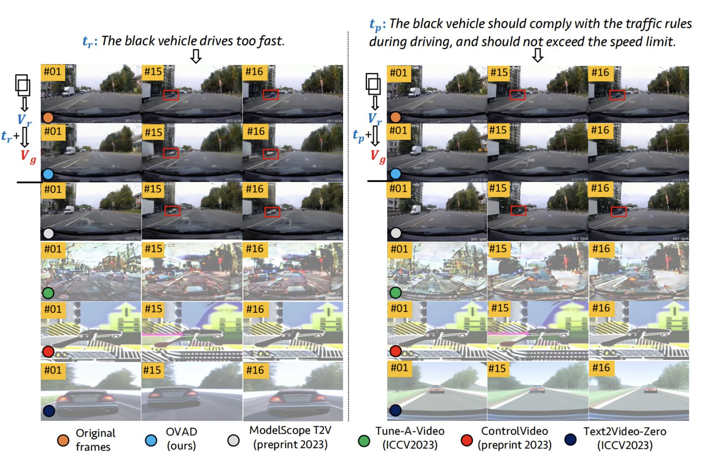

# Ego-view Accident Video Diffusion Evaluation

<div align="center">
  
  <div>&nbsp;</div>

  <div>&nbsp;</div>
</div>

This is our ego-view accident video generation benchmark that can be driven by different text descriptions annotated in MM-AU. The performance is measured by the [CLIP Score (CLIPs)](https://openaccess.thecvf.com/content/ICCV2023/html/Wu_Tune-A-Video_One-Shot_Tuning_of_Image_Diffusion_Models_for_Text-to-Video_Generation_ICCV_2023_paper.html), [Fréchet Video Distance (FVD)](https://arxiv.org/abs/1812.01717) and Frames Per Second (FPS). We aim to explore the cause-effect evolution of accident videos conditioned by the descriptions of accident reasons or prevention advice.


## Benchmark

| ID | Method | Year | Code | CLIPs | FVD | FPS |Runtime | Environment |
|:--:|:--:|:--:|:--:|:--:|:--:|:--:|:--:|:--:|
| 1 | [Tune-A-Video](https://openaccess.thecvf.com/content/ICCV2023/html/Wu_Tune-A-Video_One-Shot_Tuning_of_Image_Diffusion_Models_for_Text-to-Video_Generation_ICCV_2023_paper.html) | 2023 | [code](https://github.com/showlab/Tune-A-Video) | 21.77 | 9545.6 | 1.7 | ... | GeForce RTX 3090 |
| 2 | [ControlVideo](https://arxiv.org/abs/2305.17098) | 2023 | [code](https://github.com/thu-ml/controlvideo) | 22.51 | 12275.2 | 0.5 | ... | GeForce RTX 3090 |
| 3 | OVAD(ours) | 2023 | [code]() | 27.24 | 5238.1 | 1.2 | ... | GeForce RTX 3090 |
| 4 | [ModelScope T2V](https://arxiv.org/abs/2308.06571) | 2023 | [code](https://github.com/exponentialml/text-to-video-finetuning) | 27.15 | 5088.778 | 1.3 | ... | GeForce RTX 3090 |
| 5 | [Text2Video-Zero](https://arxiv.org/abs/2303.13439) | 2023 | [code](https://github.com/picsart-ai-research/text2video-zero) | 27.89 | 12547.075 | 1.1 | ... | GeForce RTX 3090 |


### NOTE: You can submit your metric values via the provided form [THERE](http://www.lotvsmmau.net/MMAU/VG#). Furthermore, we would highly appreciate for your contribution with clear links to relevant articles and code for more in-depth analysis.

## OAVD(ours)
### Train A_CLIP
a.Download the [pretraining clip model](https://pan.baidu.com/s/1DwBFk1Fr5MHdM25eNFRf4g) code:(mkpx)

b.Download the [MM-AU Benchmark](http://www.lotvsmmau.net)

c.Make data structure and write the root_path (The path of dataset) to A_CLIP/configs/A_CLIP.yaml
>[root_path]
>>1,2,3,....
>>[OOD_train.txt]

d.```Run T_CLIP.py```